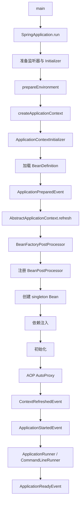

# Spring 应用启动过程中的设计模式系统解析

> 面向 Java 高级开发 / Spring 源码面试 / 架构设计复习  
> 版本语境：以 Spring Framework 6.x/7.x、Spring Boot 3.x/4.x 的共同主链路为核心。不同小版本的内部实现细节可能调整，但本文讨论的核心扩展点与设计思想长期稳定。

---

## 目录

1. [为什么要从“启动流程”理解 Spring 设计模式](#1-为什么要从启动流程理解-spring-设计模式)
2. [先建立全局认知：Spring Boot 启动主链路](#2-先建立全局认知spring-boot-启动主链路)
3. [设计模式总览：它们分别出现在启动流程哪里](#3-设计模式总览它们分别出现在启动流程哪里)
4. [模板方法模式：ApplicationContext.refresh () 为什么是 Spring 容器的骨架](#4-模板方法模式applicationcontextrefresh-为什么是-spring-容器的骨架)
5. [工厂模式：BeanFactory、FactoryBean、ObjectFactory 到底是什么关系](#5-工厂模式beanfactoryfactorybeanobjectfactory-到底是什么关系)
6. [策略模式：Spring 为什么能替换实例化、候选解析、事件派发等算法](#6-策略模式spring-为什么能替换实例化候选解析事件派发等算法)
7. [观察者模式：SpringApplicationEvent 与 ApplicationEvent 如何贯穿启动流程](#7-观察者模式springapplicationevent-与-applicationevent-如何贯穿启动流程)
8. [处理器链 / 责任链思想：BeanFactoryPostProcessor 与 BeanPostProcessor](#8-处理器链--责任链思想beanfactorypostprocessor-与-beanpostprocessor)
9. [代理模式：AOP 代理是在 Bean 生命周期的哪个阶段产生的](#9-代理模式aop-代理是在-bean-生命周期的哪个阶段产生的)
10. [单例注册表：Spring singleton 与 GoF Singleton 有什么不同](#10-单例注册表spring-singleton-与-gof-singleton-有什么不同)
11. [适配器模式：Spring 如何把不同回调形式统一起来](#11-适配器模式spring-如何把不同回调形式统一起来)
12. [构建器模式：SpringApplicationBuilder 的价值是什么](#12-构建器模式springapplicationbuilder-的价值是什么)
13. [外观模式：SpringApplication 和 ApplicationContext 为什么像 Facade](#13-外观模式springapplication-和-applicationcontext-为什么像-facade)
14. [条件策略与插件机制：Spring Boot 自动配置背后的设计思想](#14-条件策略与插件机制spring-boot-自动配置背后的设计思想)
15. [三级缓存与 ObjectFactory：循环依赖中到底用了什么设计思想](#15-三级缓存与-objectfactory循环依赖中到底用了什么设计思想)
16. [把设计模式放回单 Bean 创建流程](#16-把设计模式放回单-bean-创建流程)
17. [把设计模式放回完整 Spring Boot 启动流程](#17-把设计模式放回完整-spring-boot-启动流程)
18. [容易答错的面试误区](#18-容易答错的面试误区)
19. [高级面试追问与参考答案](#19-高级面试追问与参考答案)
20. [一页速查表](#20-一页速查表)
21. [参考资料](#21-参考资料)

---

# 1. 为什么要从“启动流程”理解 Spring 设计模式

很多面试回答会变成下面这种形式：

- BeanFactory：工厂模式；
- ApplicationEvent：观察者模式；
- AOP：代理模式；
- refresh：模板方法模式；
- BeanPostProcessor：责任链模式。

这些答案本身并不完全错，但问题在于： **彼此之间是割裂的**。

高级开发真正应该理解的是：

> Spring 不是为了“展示设计模式”而使用设计模式，而是为了把一个极其复杂的容器启动过程拆成稳定骨架、可替换策略、可插拔扩展点以及运行时增强机制。

从启动过程来看，Spring 面临五类核心问题：

1. **流程必须稳定**：容器启动的大阶段不能被业务代码随意打乱；
2. **局部算法必须可替换**：不同 Web 类型、不同实例化方式、不同依赖解析算法可以变化；
3. **第三方组件必须可扩展**：Spring Boot、MyBatis、Dubbo、事务、缓存、AOP 都需要在不修改 Spring 核心代码的前提下接入；
4. **对象创建必须集中治理**：依赖注入、生命周期、代理、作用域、销毁都要由容器统一管理；
5. **框架内部必须解耦**：环境准备、上下文初始化、Bean 创建、事件通知、Runner 执行不能彼此硬编码。

因此从宏观上看：

```text
Spring 的启动过程
=
模板方法控制主流程
+ 工厂负责对象创建
+ 策略负责算法替换
+ Processor 链负责扩展
+ Observer 负责阶段通知
+ Proxy 负责运行时增强
+ Registry 负责对象缓存与生命周期
+ Adapter 统一不同扩展接口
```

这也是本文的核心主线。

---

# 2. 先建立全局认知：Spring Boot 启动主链路

一个典型 Spring Boot 应用：

```java

@SpringBootApplication
public class DemoApplication {
    public static void main(String[] args) {
        SpringApplication.run(DemoApplication.class, args);
    }
}
```

不要把 `SpringApplication.run()` 理解成“启动 Tomcat”。它实际上完成的是：

```text
创建并配置 SpringApplication
        ↓
准备 Bootstrap 级监听器 / Initializer
        ↓
准备 Environment
        ↓
决定 ApplicationContext 类型
        ↓
创建 ApplicationContext
        ↓
执行 ApplicationContextInitializer
        ↓
加载 BeanDefinition
        ↓
context.refresh()
        ↓
执行 BeanFactoryPostProcessor
        ↓
注册 BeanPostProcessor
        ↓
实例化非懒加载 singleton Bean
        ↓
依赖注入 / 生命周期 / AOP 代理
        ↓
启动 WebServer、Lifecycle 组件
        ↓
发布 ApplicationStartedEvent
        ↓
执行 ApplicationRunner / CommandLineRunner
        ↓
发布 ApplicationReadyEvent
```

用 Mermaid 表示：



Spring Boot 官方文档给出的关键事件顺序大致是：

```text
ApplicationStartingEvent
→ ApplicationEnvironmentPreparedEvent
→ ApplicationContextInitializedEvent
→ ApplicationPreparedEvent
→ ContextRefreshedEvent / WebServerInitializedEvent
→ ApplicationStartedEvent
→ ApplicationReadyEvent
```

如果启动失败，则会出现：

```text
ApplicationFailedEvent
```

理解这条链路以后，再看设计模式会非常自然。

---

# 3. 设计模式总览：它们分别出现在启动流程哪里

| 设计思想 / 模式           | Spring 中典型实现                                                                 | 启动阶段                        | 解决的问题                                      |
|---------------------------|-----------------------------------------------------------------------------------|---------------------------------|-------------------------------------------------|
| 模板方法                  | `AbstractApplicationContext.refresh()`                                            | 容器刷新                        | 固定总体流程，允许子类扩展局部步骤              |
| 工厂模式                  | `BeanFactory`、`FactoryBean`、`ObjectFactory`                                     | Bean 创建                       | 集中对象创建，隐藏创建复杂度                    |
| 策略模式                  | `InstantiationStrategy`、`AutowireCandidateResolver`、`ApplicationContextFactory` | 多阶段                          | 替换不同算法而不改变主流程                      |
| 观察者模式                | `ApplicationEventPublisher`、`ApplicationListener`                                | Boot 启动和 Context 生命周期    | 解耦状态变化和监听行为                          |
| Processor 链 / 责任链思想 | `BeanFactoryPostProcessor`、`BeanPostProcessor`                                   | BeanDefinition 和 Bean 生命周期 | 让第三方在统一扩展点插入处理逻辑                |
| 代理模式                  | JDK Proxy、CGLIB、`AbstractAutoProxyCreator`                                      | Bean 初始化后                   | 事务、缓存、AOP 等横切增强                      |
| 注册表                    | `DefaultSingletonBeanRegistry`                                                    | Bean 创建与获取                 | 管理 singleton 生命周期与缓存                   |
| 适配器模式                | `ApplicationListenerMethodAdapter`、`DisposableBeanAdapter`                       | 事件与销毁                      | 将不同形式的用户 API 适配为容器内部统一调用方式 |
| Builder                   | `SpringApplicationBuilder`                                                        | Boot 启动入口                   | 流式构造复杂 SpringApplication                  |
| Facade                    | `SpringApplication`、`ApplicationContext`                                         | 启动入口/容器使用               | 对复杂子系统提供统一入口                        |
| Callback / SPI            | `ApplicationContextInitializer`、`EnvironmentPostProcessor`                       | Context 创建前                  | 为 Boot 和三方框架提供早期扩展能力              |
| 条件策略                  | `Condition`、`@Conditional*`                                                      | 配置类解析                      | 根据运行环境动态决定 BeanDefinition 是否生效    |

需要注意：

> 并不是 Spring 中所有机制都应该强行对应一个经典 GoF 模式。

例如：

- `BeanPostProcessor` 更准确的说法是 **Processor Chain / Plugin Extension Point**；
- 它具有责任链思想，但不是严格意义上“每个 Handler 持有 next Handler”的经典责任链；
- Spring 的 prototype scope 也不等同于 GoF 的 Prototype Pattern。

高级面试时，能说清这种边界，比机械背模式名称更重要。

---

# 4. 模板方法模式：ApplicationContext.refresh () 为什么是 Spring 容器的骨架

## 4.1 模板方法模式是什么

模板方法模式的核心是：

> 父类定义稳定的算法骨架，把部分步骤延迟给子类实现或覆盖。

示意：

```java
abstract class AbstractTask {
    public final void execute() {
        step1();
        step2();
        step3();
    }

    protected void step1() {
    }

    protected abstract void step2();

    protected void step3() {
    }
}
```

## 4.2 Spring 中最经典的例子：AbstractApplicationContext.refresh ()

`AbstractApplicationContext` 的源码注释本身就明确指出其使用了 Template Method 思想。

核心结构可以简化为：

```java
public void refresh() {
    prepareRefresh();

    ConfigurableListableBeanFactory beanFactory = obtainFreshBeanFactory();

    prepareBeanFactory(beanFactory);

    postProcessBeanFactory(beanFactory);

    invokeBeanFactoryPostProcessors(beanFactory);

    registerBeanPostProcessors(beanFactory);

    initMessageSource();

    initApplicationEventMulticaster();

    onRefresh();

    registerListeners();

    finishBeanFactoryInitialization(beanFactory);

    finishRefresh();
}
```

这个方法非常重要，因为它体现了 Spring 容器启动的“骨架”。

## 4.3 为什么 refresh () 适合模板方法

Spring 必须保证下面顺序成立：

```text
BeanDefinition 已经准备好
        ↓
BeanFactoryPostProcessor 才能修改 BeanDefinition
        ↓
BeanPostProcessor 必须在普通 Bean 大量创建前注册
        ↓
普通 singleton Bean 才能开始实例化
        ↓
最后才能认为 Context refresh 完成
```

如果每个 `ApplicationContext` 子类都自己写一套启动代码，很容易出现：

- BPP 注册太晚；
- Bean 提前实例化；
- AOP 失效；
- 事件系统未准备好；
- WebServer 生命周期错乱。

因此 Spring 采取：

```text
稳定主流程：由 AbstractApplicationContext 控制
变化部分：留给子类扩展
```

例如：

```java
protected void postProcessBeanFactory(...) {
}

protected void onRefresh() {
}
```

不同上下文可以扩展这些 Hook。

## 4.4 面试回答模板

> Spring 中模板方法最典型的是 `AbstractApplicationContext.refresh()`。它固定了容器刷新的主流程，例如准备 BeanFactory、调用
> BeanFactoryPostProcessor、注册 BeanPostProcessor、初始化事件广播器、实例化剩余 singleton、发布 refresh 完成事件。具体
> ApplicationContext 子类可以通过 `postProcessBeanFactory()`、`onRefresh()` 等扩展点定制局部步骤。这样既保证容器启动顺序稳定，又保留扩展能力。

---

# 5. 工厂模式：BeanFactory、FactoryBean、ObjectFactory 到底是什么关系

这是 Spring 面试中最容易混乱的一组概念。

## 5.1 BeanFactory：容器级对象工厂

`BeanFactory` 的职责是：

```text
根据 BeanDefinition
→ 解析依赖
→ 创建 Bean
→ 注入属性
→ 执行生命周期
→ 应用 BeanPostProcessor
→ 返回最终 Bean
```

它不是简单：

```java
new UserService();
```

而更像：

```text
Object getBean(String name)
    ↓
查 singleton
    ↓
解析 BeanDefinition
    ↓
创建依赖
    ↓
实例化
    ↓
populateBean
    ↓
initializeBean
    ↓
可能包装成代理
    ↓
返回
```

因此 BeanFactory 是典型的“工厂思想”。

---

## 5.2 FactoryBean：Bean 的生产者 Bean

假设一个对象创建过程非常复杂：

```java
public class ConnectionFactoryBean implements FactoryBean<Connection> {

    @Override
    public Connection getObject() {
        return createComplexConnection();
    }

    @Override
    public Class<?> getObjectType() {
        return Connection.class;
    }
}
```

注册：

```text
connectionFactoryBean
```

调用：

```java
context.getBean("connectionFactoryBean");
```

拿到的是：

```text
FactoryBean#getObject() 返回的对象
```

如果希望拿 FactoryBean 本身：

```java
context.getBean("&connectionFactoryBean");
```

关键区别：

| 概念        | 本质                                |
|-------------|-------------------------------------|
| BeanFactory | Spring IoC 容器本身，是 Bean 的工厂 |
| FactoryBean | 一个特殊 Bean，用来创建某种复杂对象 |

典型使用包括大量框架代理对象或基础设施对象的创建。

---

## 5.3 ObjectFactory：延迟获取对象的轻量工厂回调

接口思想非常简单：

```java
public interface ObjectFactory<T> {
    T getObject();
}
```

它常用于：

- 延迟创建；
- Scope；
- 循环依赖早期引用；
- `ObjectProvider` 的底层抽象之一。

三级缓存中：

```java
singletonFactories.put(beanName,
    () ->

getEarlyBeanReference(beanName, mbd, bean));
```

这里不是直接缓存一个固定对象，而是缓存：

```text
“如果未来有人提前需要这个 Bean，应该如何得到早期引用”的工厂
```

这是三级缓存最关键的设计价值之一。

---

## 5.4 Factory Method 也广泛存在

Bean 本身也可以通过静态工厂方法创建：

```java

@Bean
public DataSource dataSource() {
    return DataSourceBuilder.create().build();
}
```

或者 BeanDefinition 指向一个 `factory-method`。

Spring 容器只关心：

```text
“如何通过统一创建协议拿到实例”
```

而不是强制所有 Bean 都必须通过构造器直接实例化。

---

# 6. 策略模式：Spring 为什么能替换实例化、候选解析、事件派发等算法

## 6.1 策略模式核心

策略模式解决的是：

> 同一个业务目标存在多套算法，运行时选择其中一种。

```java
interface Strategy {
    Result execute(Context context);
}
```

调用方只依赖接口，不依赖具体策略。

---

## 6.2 InstantiationStrategy

Bean 实例化并不永远等同于：

```java
clazz.getDeclaredConstructor().

newInstance();
```

Spring 把实例化细节抽象成：

```text
InstantiationStrategy
```

这样容器创建主流程不需要知道：

- 普通反射；
- 动态子类；
- 方法注入；
- 特殊实例化行为。

主流程只需要：

```text
strategy.instantiate(...)
```

这就是标准策略模式思想。

---

## 6.3 AutowireCandidateResolver

当存在：

```java

@Autowired
private PaymentService paymentService;
```

容器需要回答：

```text
多个 PaymentService 中谁是候选？
@Qualifier 怎么处理？
@Primary 怎么处理？
是否支持 @Value？
是否支持 Lazy Proxy？
```

这些“候选解析规则”也应该从 BeanFactory 主流程中拆出来。

所以 Spring 使用候选解析策略，让容器扩展新的依赖解析语义，而不用重写 `doResolveDependency()` 整体流程。

---

## 6.4 ApplicationContextFactory

Spring Boot 根据应用类型选择上下文：

```text
Servlet Web
→ Servlet WebServer ApplicationContext

Reactive Web
→ Reactive WebServer ApplicationContext

非 Web
→ 普通 AnnotationConfigApplicationContext
```

而 Boot 还允许替换 ApplicationContext 创建工厂。

这体现的是：

```text
SpringApplication 只负责“我要一个合适的 ApplicationContext”
具体怎么创建 → 交给策略/工厂
```

---

## 6.5 Scope 也是策略

例如：

```text
singleton
prototype
request
session
```

可以理解为：

> “同一个 beanName 请求到来时，实例应该如何获取”的不同策略。

因此 Spring 的 Scope 抽象具有明显策略模式特征。

---

# 7. 观察者模式：SpringApplicationEvent 与 ApplicationEvent 如何贯穿启动流程

## 7.1 标准观察者结构

```text
Subject / Publisher
        ↓
发布 Event
        ↓
Observer / Listener
```

Spring 对应：

```text
ApplicationEventPublisher
        ↓
ApplicationEventMulticaster
        ↓
ApplicationListener
```

例如：

```java

@Component
class OrderListener {

    @EventListener
    public void onOrderCreated(OrderCreatedEvent event) {
    }
}
```

发布：

```java
publisher.publishEvent(new OrderCreatedEvent(...));
```

发布方根本不需要知道有几个监听器。

---

## 7.2 启动过程中 Observer 的价值

Spring Boot 启动本身就是一个不断发生状态变化的过程：

```text
开始启动
→ Environment 准备完成
→ Context 创建完成
→ BeanDefinition 加载完成
→ Context Refresh 完成
→ Runner 执行完成
→ 应用 Ready
```

如果 SpringApplication 写成：

```java
loggingSystem.onStarting();
configSystem.

onStarting();
monitor.

onStarting();
...
```

SpringApplication 会直接依赖所有模块。

而事件机制变成：

```java
listeners.starting();
```

不同模块自己订阅。

于是：

```text
SpringApplication
不需要知道
“谁关心这个启动阶段”
```

这就是观察者模式的核心价值。

---

## 7.3 默认事件是同步的

Spring Framework 默认事件监听通常是同步调用：

```text
publishEvent()
→ multicastEvent()
→ listener.onApplicationEvent()
→ 返回后 publishEvent 才继续
```

因此启动阶段事件监听器中不能随便做：

- 长时间网络 IO；
- 大量数据初始化；
- 无限重试。

否则它会直接拉长启动时间。

高级面试可以补充：

> 观察者模式只描述对象关系，并不意味着事件天然异步。Spring 默认 ApplicationEvent 仍然是同步传播，异步需要额外配置执行器或使用异步机制。

---

# 8. 处理器链 / 责任链思想：BeanFactoryPostProcessor 与 BeanPostProcessor

这是 Spring 可扩展性的核心。

## 8.1 两类 Processor 的层次不同

### BeanFactoryPostProcessor

操作对象：

```text
BeanDefinition / BeanFactory 元数据
```

时机：

```text
普通 Bean 实例化之前
```

典型：

```text
ConfigurationClassPostProcessor
```

它可以继续扫描：

- `@Configuration`；
- `@ComponentScan`；
- `@Import`；
- `@Bean`；
- 自动配置类。

也就是说：

> Spring 启动时，BeanDefinition 并不是“一开始就全部存在”，而是在 BFPP 阶段继续扩展出来的。

---

### BeanPostProcessor

操作对象：

```text
已经实例化出来的 Bean 实例
```

典型时序：

```text
实例化
→ 属性注入
→ postProcessBeforeInitialization
→ @PostConstruct / afterPropertiesSet / init-method
→ postProcessAfterInitialization
```

AOP 自动代理创建器也是 BPP 体系的重要成员。

Spring 官方文档明确指出：一些 AOP 基础设施就是通过 BeanPostProcessor 实现 proxy wrapping。

---

## 8.2 为什么说是“责任链思想”，但不要答得太死

在 `BeanPostProcessor` 链中：

```text
bean
 ↓
BPP1
 ↓
BPP2
 ↓
BPP3
 ↓
最终 Bean
```

每个 Processor 都有机会：

- 检查；
- 修改；
- 包装；
- 返回代理。

这非常像责任链。

但经典 GoF Chain of Responsibility 通常是：

```java
handler.setNext(nextHandler);
```

每个 Handler 主动决定是否向下传递。

Spring 则更常见：

```text
容器持有 Processor List
容器按顺序迭代调用
```

所以最严谨表述是：

> BeanPostProcessor 体现了责任链/过滤器链式处理思想，本质上又是一个典型插件扩展点；它并不完全等价于最传统的 next-handler
> 形式责任链实现。

---

## 8.3 为什么 Processor 设计如此重要

Spring 自己无法提前知道未来所有框架功能：

```text
事务
缓存
异步
MyBatis Mapper
Dubbo Reference
配置绑定
AOP
自定义注解
```

如果所有功能都写进 BeanFactory：

```text
BeanFactory 将变成超级巨类
```

而 Processor 模式让 Spring 变成：

```text
稳定核心 + 插件体系
```

这是 Spring 架构设计的精髓。

---

# 9. 代理模式：AOP 代理是在 Bean 生命周期的哪个阶段产生的

## 9.1 代理模式核心

```text
Client
  ↓
Proxy
  ↓
Target
```

代理对象与目标对象暴露相同或兼容的访问接口，但在调用前后插入增强逻辑。

例如：

```text
@Transactional
@Cacheable
@Async
自定义 AOP
```

都可能通过代理体系实现。

---

## 9.2 Spring AOP 并不是启动时统一扫描完以后直接替换所有 Bean

更准确流程：

```text
BeanDefinition
    ↓
实例化原始对象
    ↓
populateBean
    ↓
initializeBean
    ↓
BeanPostProcessor
    ↓
AbstractAutoProxyCreator 判断是否需要代理
    ↓
需要 → 创建 AOP Proxy
不需要 → 返回原始 Bean
```

因此：

```text
容器最终缓存的 singleton
可能是原始对象
也可能是代理对象
```

---

## 9.3 JDK Proxy 与 CGLIB

大致理解：

```text
接口代理
→ JDK Dynamic Proxy

类代理
→ CGLIB 子类代理
```

现代 Spring 内部会根据配置、类型等选择具体代理策略。

核心不是死背选择条件，而是理解：

> ProxyFactory / AopProxyFactory 把“代理创建方式”继续抽象成可替换策略，因此代理模式内部又组合了工厂和策略模式。

Spring 很少“只使用一种设计模式”。

---

## 9.4 为什么同类调用会导致事务失效

假设：

```java

@Service
public class OrderService {

    public void create() {
        save();
    }

    @Transactional
    public void save() {
    }
}
```

外部调用：

```text
Controller
→ OrderService Proxy
→ TransactionInterceptor
→ Target.create()
```

但是 `create()` 内部：

```java
this.save();
```

实际调用路径：

```text
Target.create()
→ Target.save()
```

没有重新经过 Proxy，所以事务增强无法拦截。

因此事务失效问题，本质上是代理模式调用边界问题。

---

# 10. 单例注册表：Spring singleton 与 GoF Singleton 有什么不同

这是一个高级开发必须答清楚的问题。

## 10.1 GoF Singleton

经典单例通常是对象自己控制唯一实例：

```java
class Singleton {
    private static final Singleton INSTANCE = new Singleton();

    private Singleton() {
    }

    public static Singleton getInstance() {
        return INSTANCE;
    }
}
```

特点：

```text
类自己控制实例唯一性
```

---

## 10.2 Spring singleton

Spring singleton 更接近：

```text
每个 BeanFactory / ApplicationContext
每个 beanName
只维护一个共享实例
```

由容器控制。

核心缓存位于类似：

```text
DefaultSingletonBeanRegistry
```

核心思想：

```java
Map<String, Object> singletonObjects;
```

所以：

```text
两个 ApplicationContext
可以各自拥有一个 userService singleton
```

这和 JVM 全局唯一完全不同。

---

## 10.3 更准确的模式名称

如果一定要从模式角度解释：

> Spring singleton 的实现更接近“容器维护的 Singleton Registry / Registry Pattern”，而不是 Bean 类自身采用 GoF Singleton
> Pattern。

面试时这样回答通常比“Spring 用了单例模式”更加严谨。

---

# 11. 适配器模式：Spring 如何把不同回调形式统一起来

## 11.1 为什么 Spring 需要 Adapter

框架希望对外提供易用 API：

```java

@EventListener
public void handle(UserCreatedEvent event) {
}
```

但是内部事件系统更希望统一调用：

```text
ApplicationListener.onApplicationEvent(event)
```

怎么办？

Spring 可以使用 Adapter：

```text
用户声明 @EventListener 方法
        ↓
ApplicationListenerMethodAdapter
        ↓
适配为内部 Listener 调用模型
```

这就是适配器的典型价值：

```text
不要求用户实现底层接口
但内部仍能使用统一协议
```

---

## 11.2 DisposableBeanAdapter

Bean 销毁时可能存在多种生命周期声明：

```text
@PreDestroy
DisposableBean.destroy()
自定义 destroyMethod
```

容器不希望调用方到处写：

```java
if(bean instanceof DisposableBean)...
        if(hasPreDestroy)...
        if(hasCustomDestroy)...
```

于是可以通过统一 Adapter 包装并执行多种销毁协议。

这种设计的目标是：

```text
外部 API 多样
内部生命周期协议统一
```

---

# 12. 构建器模式：SpringApplicationBuilder 的价值是什么

简单启动：

```java
SpringApplication.run(App .class, args);
```

复杂启动可能需要：

```java
new SpringApplicationBuilder()
        .

sources(ParentConfig .class)
        .

profiles("prod")
        .

properties("server.port=8080")
        .

child(ChildConfig .class)
        .

run(args);
```

当一个对象拥有大量可选参数时：

```text
new SpringApplication(a,b,c,d,e,f,g...)
```

会非常难维护。

Builder 让配置变成：

```text
逐步构建
+ 流式表达
+ 可读性更强
+ 支持复杂父子 Context
```

这就是 `SpringApplicationBuilder` 的典型价值。

---

# 13. 外观模式：SpringApplication 和 ApplicationContext 为什么像 Facade

Facade Pattern 的目标：

> 给复杂子系统提供一个更简单的统一入口。

用户只写：

```java
SpringApplication.run(App .class, args);
```

但背后涉及：

```text
Environment
ApplicationContext
BeanFactory
BeanDefinitionRegistry
ResourceLoader
EventMulticaster
LifecycleProcessor
WebServer
AutoConfiguration
Runner
```

从用户视角：

```text
SpringApplication = 启动复杂基础设施的统一门面
```

类似地：

```text
ApplicationContext
```

也是对：

```text
BeanFactory + ResourceLoader + EventPublisher + MessageSource + Lifecycle
```

等能力的高级统一入口。

需要注意：

> Spring 官方并不会把 `ApplicationContext` 明确定义为“GoF Facade”，但从设计职责角度，它明显具有 Facade 特征。

因此面试回答最好说：

```text
“体现了外观模式思想”
```

而不是绝对化地说：

```text
“ApplicationContext 就是 GoF Facade 实现”
```

---

# 14. 条件策略与插件机制：Spring Boot 自动配置背后的设计思想

Spring Boot 自动配置是启动流程中最值得深入理解的一部分。

## 14.1 @SpringBootApplication 做了什么

概念上可以拆成：

```text
@SpringBootConfiguration
@EnableAutoConfiguration
@ComponentScan
```

于是启动过程中既会：

```text
扫描用户 Bean
```

又会：

```text
导入 AutoConfiguration
```

---

## 14.2 自动配置类如何发现

现代 Spring Boot 的自动配置候选主要通过：

```text
META-INF/spring/
org.springframework.boot.autoconfigure.AutoConfiguration.imports
```

列出自动配置类。

这非常重要，因为老面试材料经常只回答：

```text
“所有自动配置都从 spring.factories 加载”
```

这已经不是现代 Boot 自动配置候选发现的完整表述。

---

## 14.3 @Conditional 是策略模式思想

例如：

```java

@ConditionalOnClass(DataSource.class)
@ConditionalOnMissingBean(DataSource.class)
class DataSourceAutoConfiguration {
}
```

本质上是在说：

```text
如果 Classpath 满足条件
并且用户没有定义目标 Bean
→ 自动配置生效
```

这里的核心抽象是：

```text
Condition
```

不同条件实现不同判断算法：

```text
Class Condition
Bean Condition
Property Condition
Resource Condition
Web Application Condition
```

可以理解为：

```text
配置导入流程固定
条件判断算法可替换
```

具有非常明显的策略模式思想。

---

## 14.4 “约定优于配置”背后的模式组合

Spring Boot 自动配置实际上组合了多种思想：

```text
AutoConfiguration.imports
→ Plugin/SPI 候选发现

Condition
→ Strategy

ConfigurationClassPostProcessor
→ Processor / Compiler-like Pipeline

BeanDefinitionRegistry
→ Registry

BeanFactory
→ Factory
```

所以如果面试官问：

> Spring Boot 自动配置是什么设计模式？

不要回答一个单独模式。

更好的回答是：

> 自动配置不是由某一个 GoF 模式完成，而是插件发现 + 条件策略 + 配置类解析 Processor + BeanDefinition 注册表 + IoC
> 工厂共同实现的一套机制。

---

# 15. 三级缓存与 ObjectFactory：循环依赖中到底用了什么设计思想

Spring singleton 循环依赖是非常适合考察“源码理解深度”的题。

## 15.1 三个核心 Map

经典理解：

```text
一级缓存 singletonObjects
→ 完整 singleton Bean

二级缓存 earlySingletonObjects
→ 已经暴露过的 early Bean 引用

三级缓存 singletonFactories
→ ObjectFactory，可按需生成 early reference
```

简化：

```java
Map<String, Object> singletonObjects;
Map<String, Object> earlySingletonObjects;
Map<String, ObjectFactory<?>> singletonFactories;
```

---

## 15.2 为什么三级不是简单缓存一个原始对象

假设：

```text
A 需要代理
A 依赖 B
B 又依赖 A
```

A 实例化后，如果三级缓存直接放：

```text
raw A
```

那么 B 注入的可能是原始 A。

但最终 A 对外暴露的是：

```text
A Proxy
```

于是会出现：

```text
B 持有 raw A
其他 Bean 持有 A Proxy
```

对象身份不一致。

所以 Spring 放入的是：

```java
ObjectFactory<?> factory =
        () -> getEarlyBeanReference(beanName, mbd, bean);
```

真正有人需要 early reference 时才调用。

而 `getEarlyBeanReference()` 给自动代理创建器一个机会：

```text
如果这个 Bean 未来需要代理
→ 提前返回一个一致的代理引用
```

这说明三级缓存的真正价值不只是：

```text
“为了缓存”
```

而是：

```text
“延迟决定 early reference 应该是原始对象还是代理对象”
```

这体现了：

```text
Factory / Lazy Factory / Callback
```

设计思想。

---

## 15.3 为什么二级缓存存在

第一次：

```text
singletonFactories
→ factory.getObject()
→ early reference
```

之后把 early reference 放到：

```text
earlySingletonObjects
```

下一次直接返回。

作用：

```text
避免每次都重新执行 early reference 生成逻辑
并保证早期引用身份稳定
```

---

## 15.4 为什么构造器循环依赖通常无法这样解决

例如：

```java
class A {
    A(B b) {
    }
}

class B {
    B(A a) {
    }
}
```

A 的构造器执行前：

```text
A 实例还不存在
```

因此没有对象可以提前暴露到三级缓存。

而属性注入循环依赖的关键是：

```text
先实例化 A
→ 暂时不完成属性注入
→ 暴露 early reference
→ 再创建 B
```

所以循环依赖能否解决，关键不是“三级缓存万能”，而是：

```text
有没有一个已经实例化、但尚未完全初始化的对象可以提前暴露
```

---

# 16. 把设计模式放回单 Bean 创建流程

单 Bean 的核心创建链路可以抽象成：

```text
getBean
 ↓
doGetBean
 ↓
检查 singleton registry
 ↓
getSingleton(beanName, ObjectFactory)
 ↓
createBean
 ↓
resolveBeforeInstantiation
 ↓
doCreateBean
 ↓
createBeanInstance
 ↓
三级缓存暴露 ObjectFactory
 ↓
populateBean
 ↓
initializeBean
 ↓
BeanPostProcessor before
 ↓
init callback
 ↓
BeanPostProcessor after
 ↓
可能得到 AOP Proxy
 ↓
注册销毁逻辑
 ↓
返回最终 Bean
```

对应设计思想：

| Bean 创建阶段                     | 设计思想                         |
|-----------------------------------|----------------------------------|
| `getBean`                         | Facade + Factory                 |
| singleton 查询                    | Registry                         |
| `getSingleton(... ObjectFactory)` | Factory Callback + Lazy Creation |
| `createBeanInstance`              | Factory Method + Strategy        |
| 构造器选择                        | Strategy / Resolution Algorithm  |
| `populateBean`                    | IoC/DI + Strategy                |
| BPP before/after                  | Processor Chain                  |
| init method 统一处理              | Adapter / Callback               |
| AOP wrapping                      | Proxy + Factory + Strategy       |
| scoped bean                       | Strategy + Proxy                 |
| destroy callback                  | Adapter + Lifecycle              |

这张表非常适合面试前快速复习。

---

# 17. 把设计模式放回完整 Spring Boot 启动流程

下面从启动入口重新走一遍。

## 阶段 1：SpringApplication.run

```text
SpringApplication
```

体现：

```text
Facade
```

如果使用：

```text
SpringApplicationBuilder
```

又加入：

```text
Builder
```

---

## 阶段 2：准备 Environment

```text
prepareEnvironment
```

Spring Boot 将不同 PropertySource：

```text
系统环境变量
JVM 参数
application.yml
命令行参数
配置中心扩展
```

整合成统一 Environment。

这里体现：

```text
统一抽象 + Strategy + Ordered Chain
```

`EnvironmentPostProcessor` 等扩展点允许第三方在 Context 创建前修改 Environment。

---

## 阶段 3：创建 ApplicationContext

根据 Web 类型决定上下文类型：

```text
Servlet
Reactive
None
```

体现：

```text
Factory + Strategy
```

---

## 阶段 4：ApplicationContextInitializer

```text
context 创建完成
但还没有 refresh
```

多个 Initializer 可以依次处理 Context。

体现：

```text
Callback + Processor Chain / Strategy List
```

---

## 阶段 5：加载 BeanDefinition

配置来源可能包括：

```text
@ComponentScan
@Bean
@Import
AutoConfiguration
XML
编程式注册
```

最终统一变成：

```text
BeanDefinition
```

这体现的是一个非常重要的架构思想：

> 把不同配置语言先编译成统一中间模型 BeanDefinition，再由后续 BeanFactory 处理。

很像编译器：

```text
不同 Source
→ Intermediate Representation
→ 统一执行
```

这比强行对应某一个 GoF 模式更重要。

---

## 阶段 6：refresh ()

这里是：

```text
Template Method
```

固定整个容器启动骨架。

---

## 阶段 7：BeanFactoryPostProcessor

```text
ConfigurationClassPostProcessor
```

继续解析：

```text
@Configuration
@ComponentScan
@Import
@Bean
AutoConfiguration
```

体现：

```text
Processor / Plugin Pipeline
```

---

## 阶段 8：注册 BeanPostProcessor

此时普通 Bean 还未大规模实例化。

后续：

```text
AutowiredAnnotationBeanPostProcessor
CommonAnnotationBeanPostProcessor
AutoProxyCreator
...
```

将作用于 Bean 创建流程。

体现：

```text
Processor Chain
```

---

## 阶段 9：finishBeanFactoryInitialization

大量非 lazy singleton 开始实例化。

此阶段集中体现：

```text
Factory
Registry
Strategy
Processor Chain
Proxy
Adapter
Callback
```

可以说这是 Spring 设计模式最密集的阶段。

---

## 阶段 10：事件与 Runner

Context 完成刷新后：

```text
ContextRefreshedEvent
ApplicationStartedEvent
ApplicationRunner
CommandLineRunner
ApplicationReadyEvent
```

这里包含：

```text
Observer
Ordered Strategy List
Callback
```

---

# 18. 容易答错的面试误区

## 误区 1：BeanPostProcessor 就是标准责任链模式

不够严谨。

更准确：

> Spring 容器持有一组 BeanPostProcessor，并按照顺序迭代处理 Bean，因此体现了责任链/过滤器链思想，同时也是插件扩展点，但不是最传统的
> Handler 持有 next 的责任链结构。

---

## 误区 2：Spring singleton 就是 JVM 单例

错误。

Spring singleton 是：

```text
per-container + per-beanName
```

GoF Singleton 通常是：

```text
class-level / JVM 语义上的唯一实例控制
```

---

## 误区 3：prototype scope 就是 Prototype Pattern

两者名字相同，但概念不同。

Spring prototype：

```text
每次容器请求 Bean 时创建新实例
```

GoF Prototype Pattern：

```text
通过 clone / copy existing prototype 创建新对象
```

不能直接画等号。

---

## 误区 4：三级缓存只是三个 Map

如果只答：

```text
一级完整 Bean
二级早期 Bean
三级 ObjectFactory
```

只能算基础答案。

高级答案应该继续说明：

> 三级缓存的关键价值是延迟获得 early reference，让 `SmartInstantiationAwareBeanPostProcessor#getEarlyBeanReference()`
> 有机会提前创建与最终 AOP 语义一致的引用。

---

## 误区 5：AOP 是在扫描 BeanDefinition 时就完成的

不准确。

BeanDefinition 阶段主要解决：

```text
“这个 Bean 是什么、怎么创建”
```

真正的普通 AOP 代理通常在 Bean 生命周期的自动代理创建过程中形成。

---

## 误区 6：Spring 事件默认异步

错误。

默认情况下 Spring ApplicationEvent Listener 通常同步执行。

---

## 误区 7：Spring Boot 自动配置就是读取 spring.factories

这是老旧和不完整的答案。

现代 Spring Boot 自动配置候选主要声明在：

```text
META-INF/spring/
org.springframework.boot.autoconfigure.AutoConfiguration.imports
```

`spring.factories` 仍可能用于其他扩展机制，但不能继续把它概括成“现代 Boot 所有自动配置类唯一入口”。

---

# 19. 高级面试追问与参考答案

## 题 1：Spring 启动过程中最重要的设计模式是什么？

### 参考答案

不能只说一个模式。

如果必须选启动主线最核心的模式，我会优先说：

```text
模板方法 + Processor 扩展链
```

原因是 `AbstractApplicationContext.refresh()` 通过模板方法固定容器启动骨架，而 BeanFactoryPostProcessor 和
BeanPostProcessor 又让大量框架能力以插件方式嵌入这个骨架。

Bean 的创建则进一步组合了 Factory、Strategy、Registry 和 Proxy。

---

## 题 2：为什么 BeanFactoryPostProcessor 必须早于普通 singleton Bean 实例化？

因为 BFPP 操作的是：

```text
BeanDefinition 元数据
```

如果 Bean 已经实例化：

```text
BeanDefinition 再修改已经来不及影响这个 Bean
```

例如 `ConfigurationClassPostProcessor` 还需要继续注册新的 BeanDefinition，因此必须在普通 singleton 创建之前执行。

---

## 题 3：为什么 BeanPostProcessor 要提前注册？

因为它要拦截后续 Bean 生命周期。

如果某 Bean 在 BPP 注册前已经创建：

```text
这个 Bean 无法享受到完整的：
@Autowired 处理
@PostConstruct 处理
AOP 自动代理
某些框架增强
```

这也是 Spring 为什么非常警惕“Bean 被过早实例化”的原因。

---

## 题 4：AOP 为什么选择 BeanPostProcessor 做扩展入口？

因为 AOP 的输入正好是：

```text
已经创建并初始化到一定阶段的 Bean
```

输出是：

```text
原 Bean 或 Proxy Bean
```

这和：

```java
Object postProcessAfterInitialization(Object bean, String beanName)
```

的抽象天然匹配。

容器无需知道事务、缓存、自定义切面细节，只需要允许 BPP 替换最终 Bean 引用即可。

---

## 题 5：Spring 为什么大量采用接口，而不是直接写实现类？

核心原因不是“面向接口编程”这句口号，而是：

```text
把稳定主流程与变化算法分离
```

例如：

```text
ApplicationContextFactory
InstantiationStrategy
AutowireCandidateResolver
Scope
ApplicationEventMulticaster
```

都允许替换实现。

这让 Spring 核心代码不需要随着每一种场景增长大量 `if/else`。

---

## 题 6：SpringApplication、ApplicationContext、BeanFactory 三者应该怎么理解？

可以分三层：

```text
SpringApplication
= Bootstrap Orchestrator / 启动门面

ApplicationContext
= 高级容器门面
  集成 BeanFactory、事件、资源、国际化、Lifecycle 等

BeanFactory
= IoC 容器最核心的 Bean 创建与依赖管理抽象
```

调用链上大致是：

```text
SpringApplication
→ 创建并 refresh ApplicationContext
→ ApplicationContext 内部使用 BeanFactory 管理 Bean
```

---

## 题 7：如果没有 BeanPostProcessor，Spring 会失去什么？

至少大量高级能力会受到影响：

```text
@Autowired / @Value 处理
@PostConstruct 等注解生命周期
AOP 自动代理
事务代理
缓存代理
某些框架 Bean 增强
```

Spring 官方文档也强调，普通 `BeanFactory` 并不会像 `ApplicationContext` 一样自动发现和激活这类后处理器。

---

## 题 8：三级缓存为什么需要 ObjectFactory 而不是 Supplier<Object>？

从概念上两者都可以表达延迟工厂，但 Spring 的 `ObjectFactory` 是容器自己定义且长期稳定的轻量抽象，并被
Scope、依赖获取、ObjectProvider 等体系复用。

面试关键不在接口名字，而在理解：

```text
三级缓存缓存的是“生成早期引用的能力”
而不是简单缓存一个固定对象
```

---

## 题 9：Spring Boot 自动配置最体现什么设计思想？

推荐回答：

```text
Plugin Discovery
+ Condition Strategy
+ Configuration Processor
+ BeanDefinition Registry
+ IoC Factory
```

不要强行说它只对应一种 GoF 模式。

---

## 题 10：为什么说 Spring 是“框架”，而不是普通工具库？

普通工具库：

```text
你的代码调用库
```

Spring：

```text
Spring 控制启动流程
Spring 创建你的对象
Spring 在合适时间回调你的扩展点
```

这就是 IoC 的更广义体现：

```text
控制权在 Framework
业务代码通过 Callback / SPI / Annotation 接入
```

模板方法、回调、观察者、Processor 链共同构成了这种 Framework Control。

---

# 20. 一页速查表

```text
SpringApplication.run
│
├─ Facade：隐藏复杂启动子系统
├─ Builder：SpringApplicationBuilder
├─ Observer：SpringApplicationEvent
├─ Strategy/Factory：选择 ApplicationContext
│
└─ ApplicationContext.refresh
   │
   ├─ Template Method：固定 refresh 骨架
   │
   ├─ BeanFactoryPostProcessor
   │  └─ Processor Chain / Plugin
   │
   ├─ BeanPostProcessor 注册
   │  └─ Processor Chain / Plugin
   │
   ├─ finishBeanFactoryInitialization
   │  │
   │  └─ getBean
   │     ├─ Factory：BeanFactory
   │     ├─ Registry：singletonObjects
   │     ├─ Factory Callback：ObjectFactory
   │     ├─ Strategy：InstantiationStrategy
   │     ├─ IoC/DI：populateBean
   │     ├─ Processor Chain：BPP
   │     ├─ Proxy：AOP
   │     └─ Adapter：生命周期适配
   │
   ├─ Observer：ContextRefreshedEvent
   │
   └─ Runner Callback
      ├─ ApplicationRunner
      └─ CommandLineRunner
```

最终可以用一句话总结：

> **Spring 启动流程的核心设计不是“用了多少模式”，而是通过模板方法稳定骨架，通过工厂和注册表统一对象治理，通过策略隔离变化，通过
Processor 链开放扩展，通过事件解耦生命周期，通过代理完成运行时增强。**

如果能围绕这句话展开，而不是逐个背“XX 类用了 XX 模式”，通常就达到了高级开发应有的源码理解层次。

---

# 21. 参考资料

以下资料均来自 Spring 官方文档或官方源码仓库：

1. Spring Boot — SpringApplication 参考文档  
   https://docs.spring.io/spring-boot/reference/features/spring-application.html

2. Spring Boot — Creating Your Own Auto-configuration  
   https://docs.spring.io/spring-boot/reference/features/developing-auto-configuration.html

3. Spring Framework — IoC Container  
   https://docs.spring.io/spring-framework/reference/core/beans.html

4. Spring Framework — Container Extension Points  
   https://docs.spring.io/spring-framework/reference/core/beans/factory-extension.html

5. Spring Framework — Dependency Injection  
   https://docs.spring.io/spring-framework/reference/core/beans/dependencies/factory-collaborators.html

6. Spring Framework — Bean Scopes  
   https://docs.spring.io/spring-framework/reference/core/beans/factory-scopes.html

7. Spring Framework — ApplicationContext Events  
   https://docs.spring.io/spring-framework/reference/core/beans/context-introduction.html

8. Spring Framework Source — AbstractApplicationContext  
   https://github.com/spring-projects/spring-framework/blob/main/spring-context/src/main/java/org/springframework/context/support/AbstractApplicationContext.java

---

## 附：推荐源码阅读顺序

如果希望继续深入源码，建议不要直接全仓库跳转，而按下面顺序阅读：

```text
1. SpringApplication#run

2. AbstractApplicationContext#refresh

3. PostProcessorRegistrationDelegate
   ├─ invokeBeanFactoryPostProcessors
   └─ registerBeanPostProcessors

4. ConfigurationClassPostProcessor

5. DefaultListableBeanFactory#getBean

6. AbstractBeanFactory#doGetBean

7. AbstractAutowireCapableBeanFactory#createBean

8. AbstractAutowireCapableBeanFactory#doCreateBean
   ├─ createBeanInstance
   ├─ populateBean
   └─ initializeBean

9. DefaultSingletonBeanRegistry
   └─ getSingleton

10. AbstractAutoProxyCreator
    ├─ getEarlyBeanReference
    └─ postProcessAfterInitialization

11. ApplicationEventMulticaster

12. AutoConfigurationImportSelector / Condition 相关实现
```

阅读每一个类时都问自己三个问题：

```text
这个类属于启动的哪个阶段？
它是稳定骨架，还是可替换策略？
它提供的是工厂能力、扩展能力、事件能力还是代理能力？
```

只要能回答这三个问题，Spring 源码就不会再是一堆互相调用的方法，而会变成一套非常清晰的架构设计。
